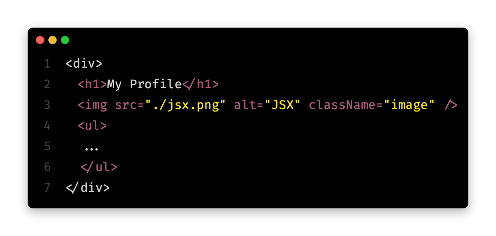

# React Interview Questions

1.What is React?

React is a javascript library for rendering user interfaces(UI). UI is built from small units like buttons, text, and images. React lets you combine them into reusable components. From websites to phone apps, everything on the screen can be broken down into components.

2.What is the React component?

Component is a basic Building Block of our React Application. React applications are built from isolated pieces of UI called components. A React component is a normal JavaScript function that returns JSX. Components can be as small as a button, or as large as an entire page. React lets you combine your markup, CSS, and JavaScript into custom `components`, reusable UI elements for your app.

##### Steps To Create a React Component :

1.  Export the component ⇒ The export default prefix is a standard JavaScript syntax (not specific to React). It lets you mark the main function in a file so that you can later import it from other files.

2.  Define the function ⇒ `function Profile() { }` you define a JavaScript function with the name Profile.

    `Note : React components are regular JavaScript functions, but their names must start with a capital letter or they won’t work!`

3.  Add markup ⇒
    The component returns an  tag with src and alt attributes.  is written like HTML, but it is actually JavaScript under the hood! This syntax is called JSX, and it lets you embed markup inside JavaScript.
    Return statements can be written all on one line, as in this component:

##### Example

```javascript
return ;
```

But if your markup isn’t all on the same line as the return keyword, you must wrap it in a pair of parentheses:

##### Example

```javascript
return (
    <div>
        
    </div>
);
```

`Note: Without parentheses, any code on the lines after return will be ignored! `

##### Example

```javascript
export default function Profile() {
    return (
        
    );
}
```

3.Can we Nest Component Definition?

Components can render other components, but you must never nest their definitions:


The snippet above is very slow and causes bugs. Instead, define every component at the top level:


When a child component needs some data from a parent, pass it by props instead of nesting definitions.

4.What is JSX?

1. JSX is a syntax extension for JavaScript that lets you write HTML-like markup inside a JavaScript file.

2. React components use a syntax extension called JSX to represent that markup.

3. JSX looks a lot like HTML, but it is a bit stricter and can display dynamic information.

4. The best way to understand this is to convert some HTML markup to JSX markup.

5. JSX is very minimal as a templating language because it lets you organize data and logic using JavaScript.

##### The rules of JSX

1. Return a single root element ⇒ To return multiple elements from a component, wrap them with a single parent tag.
   For example, you can use a <div>:

##### Example



If you don’t want to add an extra <div> to your markup, you can write <> and </> instead of Parent tag. This empty tag is called a Fragment. Fragments let you group things without leaving any trace in the browser HTML tree.

2. Close all the tags ⇒ JSX requires tags to be explicitly closed: self-closing tags like  must become , and wrapping tags like `<li>` oranges must be written as `<li>oranges</li>`

3. camelCase all most of the things! ⇒ JSX turns into JavaScript and attributes written in JSX become keys of JavaScript objects. In your own components, you will often want to read those attributes into variables. But JavaScript has limitations on variable names. For example, their names can’t contain dashes or be reserved words like class.

    This is why, in React, many HTML and SVG attributes are written in camelCase. For example, instead of stroke-width you use strokeWidth. Since class is a reserved word, in React you write className instead, named after the corresponding DOM property:

    `Note : 1. JSX and React are two separate things. They’re often used together, but you can use them independently of each other. JSX is a syntax extension, while React is a JavaScript library.`

    `2.For historical reasons, aria-_ and data-_ attributes are written as in HTML with dashes.`
